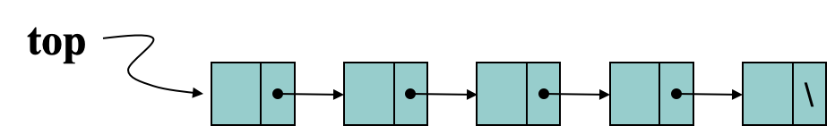
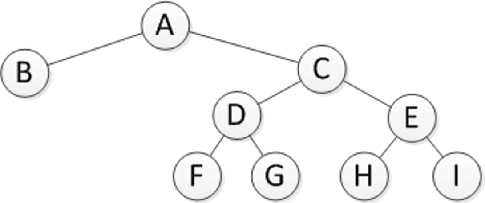

# 数据结构与算法分析

## 第一章 概论

### 数据结构的概念

数据结构描述的是按照一定逻辑关系组织起来的待处理数据元素的表示及相关操作，涉及数据的逻辑结构、存储结构和运算.

- **逻辑结构**

  数据的逻辑结构是从具体问题抽象出来的数学模型，反映了事物的组成结构及事物之间的逻辑关系.

  可以用一组数据（结点集合 $K$）以及这些数据之间的一组二元关系（关系集合 $R$）来表示：$(K, R)$​.

  分类：线性结构（一对一）、树型结构（一对多）、图结构（多对多）.

- **存储结构**

  逻辑结构 $(K , r)$​ 在存储器中的映象.

  四种基本存储映射方法：顺序（紧凑存储结构）、链接（附加指针域）、索引（索引表）、散列（散列函数计算地址）.

### 抽象数据类型 ADT

抽象数据类型是描述数据结构的一种理论工具，指一个数学模型以及定义在该模型上的一组操作.

三元组表示：$\text{ADT}=(D,R,P)$

```c++
ADT  抽象数据类型名{
	数据对象D：<数据对象的定义>
	数据关系R：<数据关系的定义>
	基本操作P：<基本操作的定义>
} ADT 抽象数据类型名
```

### 算法的特性

- 通用性
- 有效性
- 确定性
- 有穷性

### 渐进算法分析

- 时空复杂度 $O$，$Ω$，$Θ$​ 表示法

  - 大 $O$ 表示法描述了算法在最坏情况下的上界，即最多需要多少时间.

    如果存在正数 $c$ 和 $N$，使得对任意的 $n ≧ N$，都有 $f(n) ≦ cg(n)$，则称 $f(n)$ 在集合 $O(g(n))$ 中，或简称 $f(n)$ 是 $O(g(n))$​ 的.

  - 大 $Ω$​ 表示法描述了算法在最坏情况下的下界，即最少需要多少时间。

    如果存在正数 $c$ 和 $N$，使得对任意的 $n≧N$，都有 $f(n) ≧ cg(n)$，则称 $f(n)$ 在集合 $Ω(g(n))$ 中，或简称 $f(n)$ 是 $Ω(g(n))$​ 的.

  - 大 $Θ$​ 表示法精确描述了算法的运行时间，即上界和下界是一样的.

    如果一个函数既在集合 $O(g(n))$ 中，又在集合 $Ω(g(n))$ 中，则称 $f(n)$ 为 $Θ(g(n))$​.

- 时空折中

## 第二章 线性表

### 线性结构

- 基本特征：第一元素、最后元素、唯一后继、唯一前驱.
- 特点：均匀性、有序性.
- 分类：直接访问型、顺序访问型、目录访问型.

### 线性表抽象数据类型

线性表是由称为元素的数据项组成的一种有限且有序的序列.

```c++
template <typename T> 
class List {
  void clear();			                              //置空线性表
  bool isEmpty();			                            //判线性表是否为空
  bool append(const T value);	                    //在表尾添加元素
  bool insert(const int p, const T value);				//在指定位置插入元素
  bool delete(const int p);	                      //删除元素
  bool getValue(const int p, T& value);						//返回指定元素内容
  bool setValue(const int p, const T value);			//更新指定元素内容
  bool getPos(int &p, const T value);						  //返回value元素内容的位置
  bool setPos(int pos);                           // 设置当前下标
	//有关获取位置的运算函数
	bool setStart();	  // 将当前下标移动到表头
	bool setEnd();		  //将当前下标移动到表尾
	bool prev(); 		    //将当前下标向前左移一位
	bool next(); 		    //将当前下标向后右移一位
};
```

### 线性表存储结构

- 顺序表

  定长的顺序存储结构，通常采用数组实现.

  特点：利用一片连续的存储空间依次存放线性表元素，以“物理位置相邻”表示逻辑位置.

- 链表

  变长的线性表存储结构，又称为链接式存储结构.

  特点：利用指针表示元素之间的关系.

### 顺序表

- 存储结构：用一组地址连续的存储单元依次存放线性表中的数据元素.
- 存储地址计算：$\text{Loc}(k_i) = \text{Loc}(k_0) + i \times L$​
- 特点
  - 逻辑结构与存储结构一致.
  - 属于随机存取方式，即查找每个元素所花时间基本一样.
- 优点
  - 没用使用指针，不用花费附加开销.
  - 线性表元素的读访问非常简洁便利.
  
- 缺点：空间难以扩充.

### 基于顺序表的运算

- 检索 - 平均比较次数 $O(1)$
  $$
  \sum_{i=1}^n{p\times i} = \frac{1}{n}(1+2+ ... +n)=\frac{n-1}{2}
  $$

- 插入 - 平均移动次数 $O(n)$
  $$
  \sum_{i=0}^n{p\times(n-i)}=\frac{1}{n+1}\sum_{i=0}^n(n-i)=\frac{n}{2}
  $$

- 删除 - 平均移动次数 $O(n)$
  $$
  \sum_{i=0}^{n-1}p\times (n-i-1)=\frac{1}{n}\sum_{i=0}^{n-1}{(n-i-1)}=\frac{n-1}{2}
  $$

### 链表

- 存储结构：链表是一种既存储线性表元素，又存储相互连接信息的结点集合.

- 特点

  - 逻辑顺序与物理顺序有可能不一致.
  - 属于顺序存取的存储结构，即存取每个数据元素所花费的时间不相等.

- 优点

  - 无需事先了解线性表的长度.
  - 允许线性表的长度有很大变化.
  - 能够适应经常插入删除内部元素的情况.

- 带头结点的单链表，双向链表，循环链表.

  

  

  

### 基于链表的运算

- 检索 $O(n)$
- 插入 $O(n)$
- 删除 $O(n)$

## 第三章 栈与队列

### 栈

- 特征：后进先出（LIFO表，Last-In First-Out）.

- 插入：入栈（压栈）/删除：出栈（退栈）

- 存储结构

  - 顺序栈 - 采用顺序存储结构表示的栈

    

  - 链式栈 - 采用链式存储结构表示的栈

    

- 应用

  - 括号匹配

    ```c++
    bool matching(char exp[ ]){ //验证括号匹配情况，匹配返回1。    
      Stack s;
      int i=0;  ch=exp[i++];
      while (ch!=‘#’) {	          //'#' 为表达式结束符
        switch (ch){
        case '(',: 
        case '[' : s.push(ch);   break;
        case ')' : s.top(e); 
                   if (!s.isEmpty()&& e ==‘(‘) {
                    s.pop(e); break; }
                   else    return false;
        case ']' :  s.top(e); 
                   if (!s.isEmpty()&&e ==‘[‘) {
                     s.pop(e); break; }
                   else    return false;
        }
        ch=exp[i++];
      }
      if (!s.isEmpty()) return false;
    	else return true;
    } 
    ```

  - 中缀转后缀

    ```cpp
    priority["+"] = 1;
    priority["-"] = 1;
    priority["*"] = 2;
    priority["/"] = 2;
    priority["("] = 0;
    //Windows 按 Ctrl+Z 终止输入，macOS/Linux 按 Ctrl+D 终止输入
    while (cin >> element) {
        try
        {
            //遇到数字直接加入到结果
            if (isNumber(element))
                ex.push(element);
            //遇到运算符，若栈顶运算符优先级较大则弹栈到结果直到不满足后压栈
            else if (element == "+" || element == "-" || element == "*" || element == "/") {
                while (!op.empty() && priority[element] <=priority[op.top()]) {
                    ex.push(op.top());
                    op.pop();
                }
                op.push(element);
            }
            //遇到左括号压栈
            else if (element == "(")
                op.push(element);
            //遇到右括号则弹栈到结果直到遇到左括号
            else if (element == ")") {
                while (!op.empty() && op.top() != "(") {
                    ex.push(op.top());
                    op.pop();
                }
                if (op.empty())
                    throw "Wrong expression!";
                op.pop();
            }
            else
                throw "Wrong expression!";
        }
        catch(const char *e) {
            cerr << e << endl;
            return 0;
        }
    }
    //弹出剩余运算符到结果
    while (!op.empty()) {
        ex.push(op.top());
        op.pop();
    }
    ```

  - 后缀求值

    ```c++
    while (cin >> element) {
        try
        {
            if (isNumber(element))
                calculator.push(atoi(element.c_str()));
            else if (element == "+")
                calc(1);
            else if (element == "-")
                calc(2);
            else if (element == "*")
                calc(3);
            else if (element == "/")
                calc(4);
            else
                throw "Wrong expression!";
        }
        catch(const char *e) {
            cerr << e << endl;
            return 0;
        }
    }
    
    //用到的函数
    inline void calc(int c) {
        if (calculator.size() < 2)
            throw "Wrong expression!";
        int x = calculator.top();
        calculator.pop();
        int y = calculator.top();
        calculator.pop();
        int ans;
        switch (c)
        {
        case 1:
            ans = x + y;
            break;
        case 2:
            ans = x - y;
            break;
        case 3:
            ans = x * y;
            break;
        case 4:
            ans = x / y;
            break;
        default:
            break;
        }
        calculator.push(ans);
    }
    inline bool isNumber(string x) {
        for (char i : x)
            if (!isdigit(i))
                return false;
        return true;
    }
    ```

- 递归
  - 概念：直接调用自己或通过一系列的函数调用语句间接地调用自己的函数被称为递归函数.
  - 原则
    - 至少要有一种不使用递归就能够得出结果的情况.
    - 任何递归调用都必须向原则 1 方向渐进.
  - 不足
    - 重复操作多.
    - 系统要开辟栈空间保留数据.
    - 有些语言不支持递归.

### 队列

- 特征

  - FIFO (FirstInFirstOut).
  - 队头、队尾均是浮动的.

- 存储结构

  - 链式队列

    

  - 顺序队列

    

- 循环队列

  

  - $\text{rear}=(\text{rear}+1)\%n$ | $\text{front}=(\text{front}+1)\%n$​
  - 队空 $\text{rear}==\text{front}$​
  - 队满 $(\text{rear}+1)\%n==\text{front}$​

## 第五章 二叉树

### 二叉树的概念

二叉树由结点的有限集合构成。这个有限集合或者为空集；或者由一个根结点及两棵互不相交的分别称为左子树、右子树的二叉树组成.

- 满二叉树

  如果一棵二叉树的任何结点，或者是树叶，或者恰有两棵非空子树，则此二叉树称作满二叉树.

  

- 完全二叉树

  如果一颗二叉树最多只有最下面的两层结点度数可以小于2；最下面一层的结点都集中在该层最左边的位置上，则称此二叉树为完全二叉树.

  

- 扩充二叉树

  扩充二叉树是满二叉树，新增加的空树叶(外部结点)的个数等于原来二叉树的结点(内部结点)个数加1.

  

### 二叉树的主要性质

- 二叉树的第 $i$ 层（根为第 $0$ 层，$i≥0$）最多有 $2i$ 个结点.
- 深度为 $k$ 的二叉树至多有 $2^{k+1}-1$​ 个结点.
- 任何一颗二叉树，度为 $0$ 的结点比度为 $2$ 的结点多一个.
- 满二叉树定理：非空满二叉树树叶数等于其分支结点数加 $1$​.
- 满二叉树定理推论：一个非空二叉树的空子树(指针)数目等于其结点数加 $1$​.
- 有 $n$ 个结点（$n>0$）的完全二叉树的高度为$\lceil\log_2{(n+1)}\rceil$，深度为$\lceil\log_2{(n+1)}\rceil-1$.

### 二叉树的周游

- 深度优先周游：先序/中序/后序

  ```cpp
  //非递归
  //前序遍历
  vector<int> preorderTraversal(TreeNode* root) {
      vector<int> ans;
      stack<TreeNode*> stk;
      if (root != nullptr)
          stk.push(root);
      while (!stk.empty()) {
          auto x = stk.top();
          stk.pop();
          ans.push_back(x->val);
          if (x->right != nullptr)
              stk.push(x->right);
          if (x->left != nullptr)
              stk.push(x->left);
      }
      return ans;
  }
  
  //中序遍历
  vector<int> inorderTraversal(TreeNode* root) {
      vector<int> ans;
      unordered_set<TreeNode*> vis;
      stack<TreeNode*> stk;
      if (root != nullptr)
          stk.push(root);
      while (!stk.empty()) {
          vis.insert(stk.top());
          if (stk.top()->left != nullptr && vis.find(stk.top()->left) == vis.end())
              stk.push(stk.top()->left);
          else {
              auto x = stk.top();
              stk.pop();
              ans.push_back(x->val);
              if (x->right != nullptr)
                  stk.push(x->right);
          }
      }
      return ans;
  }
  
  //后序遍历
  vector<int> postorderTraversal(TreeNode* root) {
      vector<int> ans;
      unordered_set<TreeNode*> vis;
      stack<TreeNode*> stk;
      if (root != nullptr)
          stk.push(root);
      while (!stk.empty()) {
          vis.insert(stk.top());
          if (stk.top()->left != nullptr && vis.find(stk.top()->left) == vis.end())
              stk.push(stk.top()->left);
          else if (stk.top()->right != nullptr && vis.find(stk.top()->right) == vis.end())
              stk.push(stk.top()->right);
          else {
              ans.push_back(stk.top()->val);
              stk.pop();
          }
      }
      return ans;
  }
  ```

- 广度优先周游：从二叉树的顶层（根结点）开始，自上至下逐层遍历；在同一层中，按照从左到右的顺序对结点逐一访问。

  ```cpp
  template< typename T >
  void BinaryTree< T >::levelOrder(BinaryTreeNode< T >* root){
    std::queue< BinaryTreeNode< T >* > qe;
    BinaryTreeNode< T >* pointer = root;
    if(pointer != 0){    qe.push(pointer);  }
    while(!tempqe.empty()){
      pointer = tempqe.front();    qe.pop();
      visit(pointer);
      if(pointer->LeftChild() != 0){
        qe.push(pointer->LeftChild());
      }
      if(pointer->RightChild() != 0){
        qe.push(pointer->RightChild());
      }
    }
  }
  ```

### 二叉树的存储结构

- 链式存储结构

  

  

- 完全二叉树的顺序存储结构（序号计算左右儿子位置）

### 二叉搜索树

二叉搜索树（BST）或者是一颗空树；或者是具有下列性质的二叉树：

- 对于任何一个结点，设其值为K，则该结点的左子树(若不空)的所有结点的值都小于K.

- 右子树(若不空)的所有结点的值都大于K.

- 它的左右子树也分别为二叉搜索树.
- 按照中序周游将各结点打印出来，得到的排列按照由小到大有序.

二叉搜索树的搜索过程：

- 从根结点开始，在二叉搜索树中检索值K
  - 如果根结点储存的值为K，则检索结束
  - 如果K小于根结点的值，则只需检索左子树
  - 如果K大于根结点的值，则只检索右子树

- 该过程一直持续到找到K或者遇上叶子结点
  - 如果遇上叶子结点仍没有发现K，则查找失败

删除过程分为如下情况：

- 被删除的结点是叶子
- 被删除的结点只有左子树或只有右子树
- 被删除的结点有左、右子树

### 堆

```c++
//建堆时间复杂度 O(n)
template<typename T>
void MAX_HEAPIFY(vector<T> &A, int i) {
    int l = LEFT(i), r = RIGHT(i);
    int largest = i;
    if (l <= HEAP_SIZE && A[l] > A[i])
        largest = l;
    if (r <= HEAP_SIZE && A[r] > A[largest])
        largest = r;
    if (largest != i) {
        swap(A[largest], A[i]);
        MAX_HEAPIFY(A, largest);
    }
}

template<typename T>
void BUILD_MAX_HEAP(vector<T> &A, int n) {
    HEAP_SIZE = n;
    for (int i = n >> 1; i; i--)
        MAX_HEAPIFY(A, i);
}
```

### Huffman 树

设有 $n$ 个权值 ${w_1,w_2,……w_n}$，构造一棵有 $n$ 个叶子结点的二叉树，每个叶子的权值为$w_i$,则 $wpl$ 最小的二叉树叫 Huffman 树.

路径：从树中一个结点到另一个结点之间的分支构成这两个结点间的路径.

结点路径长度：从根结点到该结点的路径上分支的数目.

树的路径长度：树中每个结点的路径长度之和.

树的带权的路径长度：树中所有叶子结点的带权路径长度之和.
$$
wpl=\sum_{i=1}^{n}{w_kl_k}
$$
构造 Huffman 树：

- 权越大的叶结点离根越近.
- 如果某个叶的权较小，可能就会离根较远.

## 第六章 树

### 基本概念

树是含有 $n$ 个结点的有穷集合 $K$ ($n>0$)，且在 $K$ 上定义一个满足以下条件的关系 $N$： 

- 有且仅有一个结点 $k_0∈K$，它对于关系 $N$ 来说没有前驱，结点 $k_0$ 称作树的根.

- 除结点 $k_0$ 外，$K$ 中的每个结点对于关系 $N$ 来说都有且仅有一个前驱.

- 除结点 $k_ 0$ 外的任何结点 $k∈K$，存在结点序列 $k_0，k_1，…，k_s(k_s=k)$，称为从根到结点 $k$ 的路径.

树的表示方法：逻辑结构、树形表示法、文氏图表示法、凹入表表示法、嵌套括号表示法.

森林是零棵或多棵不相交的树的集合.

### 森林与二叉树的等价转换

树所对应的二叉树里一个结点的左子结点是它在原来树里的第一个子结点，右子结点是它在原来的树里的下一个兄弟.

#### 将树转换成二叉树

- 加线：在树中所有兄弟结点之间加一连线.
- 抹线：对每个结点，除了其最左孩子外，去除其与其余孩子之间的连线.
- 旋转：以树的根结点为轴心，将整树顺时针转45°.

#### 将二叉树转换成树

加线、抹线、调整.

#### 森林转换成二叉树

将每棵树转换为二叉树后连接各个根.

### 树与森林的周游

- 先根周游
- 后根周游
- 层次周游

| 树       | 森   林  | 二叉树   |
| -------- | -------- | -------- |
| 先根遍历 | 先根遍历 | 先序遍历 |
| 后根遍历 | 后根遍历 | 中序遍历 |

### 树的存储结构

- 链式存储（动态左子右兄二叉链表表示法）

  

- 父指针表示法和等价类计算 ```UNION/FIND``` 算法 （并查集）

- 顺序存储 - 带右链的先根次序表示法

  

  - ```info``` 是结点的数据.
  - ```rlink``` 是右指针，指向结点的下一个兄弟.
  - ```ltag``` 是一个左标记，当结点没有子结点（即对应二叉树中结点没有左子结点时），```ltag``` 为 1，否则为 0.

- 顺序结构 - 带双标记位的先根次序表示法

  由结点的排列次序和 ```ltag```，```rtag``` 的值可推导出 ```rlink```.

  - 当结点 ```x``` 的 ```rtag``` 为 1 时，```rlink``` 为空.
  - 当结点 ```x``` 的 ```rtag``` 为 0 时，```rlink``` 指向结点序列当中排在结点x的子树结点后面的那个结点 ```y```.

### K 叉树

## 第七章 图

### 图的定义

设图 $G=(V,E)$ 和图 $G’=(V’,E’)$，且 $V’\subset V$，$E’\subset E$，则称 $G’$ 为 $G$ 的**子图**.

假设图中有 $n$ 个顶点，$e$ 条边：

- 含有 $e=n(n-1)/2$ 条边的无向图称作**完全图**.

- 含有 $e=n(n-1)$ 条弧的有向图称作**有向完全图**.

- 若边或弧的个数 $e < n\log n$​，则称作**稀疏图**，否则称作**稠密图**.

在无向图中，如果顶点 $v$ 和顶点 $w$ 之间存在一条边，则称顶点 $v$ 和 $w$ 互为**邻接点**，边 $(v,w)$ 和顶点 $v$ 和 $w$ 相关联.

与顶点 $v$ 关联的边的条数称为顶点 $v$ 的**度**.

顶点的**出度**: 以顶点 $v$ 为弧尾的弧的数目.

顶点的**入度**: 以顶点 $v$ 为弧头的弧的数目.

顶点的**度(TD)=出度(OD)+入度(ID)**.

设图 $G=(V,E)$ 中的一个顶点序列 ${ u=v_{i,0},v_{i,1}, …, v_{i,m}=w }$ 中，$(v_{i,j-1},v_{i,j})∈E, 1≤j≤m$，则称从顶点 $u$ 到顶点 $w$ 之间存在一条**路径**，路径上边的数目称作**路径长度**.

若图 $G$ 中任意两个顶点之间都有路径相通，则称此图为**连通图**.

若无向图为非连通图，则图中各个极大连通子图称作此图的**连通分量**.

对于有向图， 若任意两个顶点之间都存在一条有向路径，则称此有向图为**强连通图**；否则，其各个极大强连通子图称作它的强连通分量.

假设一个连通图有 $n$ 个顶点和 $e$ 条边，其中 $n-1$ 条边和 $n$ 个顶点构成一个极小连通子图，称该极小连通子图为此连通图的**生成树**.

对非连通图，则将由各个连通分量构成的生成树集合称做此非连通图的**生成森林**.

### 图的抽象数据类型

```cpp
class IGraph{				                          //图的ADT
public:
  int vecticesNumber();			                  //返回图的顶点个数
  int edgesNumber();			                    //返回图的边数
  Edge firstEdge(int onevertex);	            //返回与顶点关联的第一条边
  Edge nextEdge(Edge pre); 		                //返回区相关关联顶点的下一条边
  void setEdge(int from, int to, int weight);	//添加一条边
  void delEdge(int from, int to);	            //删除一条边
  bool isEdge(Edge edge);		                  //判断是否是该图的一条边
  int fromVertex(Edge edge);		              //返回边的始点
  int toVertex(Edge edge);		                //返回边的终点
  int weight(Edge edge);		                  //返回边的权值
};
```

### 图的存储结构

- 相邻矩阵

  

- 邻接表

  

### 图的周游

- 深度优先
- 广度优先

### 图的拓扑排序

通常顶点的拓扑有序序列是**不唯一的**.

若 AOV (Activity on Vextex Network) 网中存在回路，就不可能得到拓扑有序序列.

任何有向无环图，其顶点都可以排在一个拓扑序列里，其拓扑排序的方法是：

1. 选择一个入度为0的顶点且输出之.
2. 从图中删掉此顶点及所有的出边.
3. 回到第 1 步继续执行，直至图空或者图不 空但找不到无前驱（入度为 0）的顶点为止.

时间复杂度为 $O(n+e)$​.

### 图的最短路径

#### 单源最短路径 - 迪杰斯特拉算法

暴力 $O(n^2+m)=O(n^2)$ | 二叉堆 $O((n+m)\log n)=O(n\log n)$ | 优先队列 $O(m\log m)$

```c++
void dij() {
    memset(dis, 0x7f, sizeof(dis));
    dis[s] = 0;
    q.push(make_pair(0, s));
    while (!q.empty()) {
        auto x = q.top().second;
        q.pop();
        if (vis[x])
            continue;
        vis[x] = true;
        for (int i = 0; i < n; i++)
            if (edge[x][i] != INT_MAX)
                if (dis[i] > dis[x] + edge[x][i]) {
                    dis[i] = dis[x] + edge[x][i];
                    pre[i] = x;
                    if (!vis[i])
                        q.push(make_pair(dis[i], i));
                }
    }
}
```

#### 全源最短路径 - 弗洛伊德算法

时间复杂度 $O(n^3)$ | 空间复杂度 $O(n^2)$​

```cpp
for (k = 1; k <= n; k++)
  for (x = 1; x <= n; x++)
    for (y = 1; y <= n; y++)
      f[k][x][y] = min(f[k - 1][x][y], f[k - 1][x][k] + f[k - 1][k][y]);
```

### 图的最小生成树

#### Prim

加点 | 暴力 $O(n^2+m)=O(n^2)$ | 二叉堆 $O((n+m)\log n)$

```cpp
struct S {
  int u, d;
};

bool operator<(const S &x, const S &y) { return x.d > y.d; }

priority_queue<S> q;
int dis[N];
bool vis[N];

int res = 0, cnt = 0;

void Prim() {
  memset(dis, 0x3f, sizeof(dis));
  dis[1] = 0;
  q.push({1, 0});
  while (!q.empty()) {
    if (cnt >= n) break;
    int u = q.top().u, d = q.top().d;
    q.pop();
    if (vis[u]) continue;
    vis[u] = 1;
    ++cnt;
    res += d;
    for (int i = h[u]; i; i = e[i].x) {
      int v = e[i].v, w = e[i].w;
      if (w < dis[v]) {
        dis[v] = w, q.push({v, w});
      }
    }
  }
}
```

#### Kruskal

加边 ｜ 时间复杂度 $O(m\log m)$ （使用的排序算法和并查集算法时间复杂度不应该于此）

```c++
//给出一个无向图, 求出最小生成树(MST).
#include <iostream>
#include <vector>
#include <algorithm>
using namespace std;
int n, m, u, v, w, ans;
int fa[5010], siz[5010];
vector<pair<int, pair<int, int>>> edge;
inline int find(int x)
{
    if (fa[x] != x)
        return fa[x] = find(fa[x]);
    return x;
}
inline void unite(int x, int y)
{
    x = find(x), y = find(y);
    if (siz[x] < siz[y])
        swap(x, y);
    fa[y] = x;
    siz[x] += siz[y];
}
int main()
{
    cin >> n >> m;
    for (int i = 1; i <= n; i++)
        fa[i] = i, siz[i] = 1;
    for (int i = 1; i <= m; i++)
    {
        cin >> u >> v >> w;
        edge.push_back(make_pair(w, make_pair(u, v)));
    }
    sort(edge.begin(), edge.end());
    for (auto i = edge.begin(); i != edge.end(); i++)
        if (find(i->second.first) != find(i->second.second))
        {
            unite(i->second.first, i->second.second);
            ans += i->first;
        }
    cout << ans;
    return 0;
}
```

#### 比较

| 算法       | 普里姆算法 | 克鲁斯卡尔算法 |
| ---------- | ---------- | -------------- |
| 时间复杂度 | $O(n^2)$ | $O(e\log e)$ |
| 适应范围   | 稠密图     | 稀疏图         |

## 第八章 内排序

### 基本概念

- 记录(Record)

  就是结点，排序的基本单位.

- 关键码(Key)

  唯一确定记录的一个或多个域.

- 排序码(Sort Key)

  作为排序运算依据的一个或多个域.

- 序列(Sequence)

  线性表，由记录组成的集合.

- 排序(Sorting) 

  将序列中的记录按照排序码特定的顺序排列起来，即排序码域的值具有不减(或不增)的顺序.

- 内排序(Internal Sorting)

  排序过程中所有的记录都在内存中.

- 外排序(External Sorting)

  内存无法容纳所有记录，排序过程需要访问外存.

- “正序”序列

  待排序序列符合排序要求.

- “逆序”序列

  把待排序序列逆转过来，正好符合排序要求.

- “稳定的” 排序算法 

  如果存在多个具有相同排序码的记录，经过排序后这些记录的相对次序仍然保持不变.

- 排序算法的衡量标准

  比较次数与移动（交换）元素次数.

- 非递增和非递减

### 插入排序

#### 直接插入排序


稳定 ｜ 时间复杂度最优 $O(n)$，最坏 $O(n^2)$. ｜ 空间 $O(1)$

```cpp
for (int i = 2; i <= n; i++) {
    int key = arr[i], j = i - 1;
    while (j && key < arr[j]) {
        arr[j + 1] = arr[j];
        j--;
    }
    arr[j + 1] = key;
}
```

#### 希尔排序

不稳定 ｜ 总时间复杂度 $O(n\log^2 n)$｜ 空间 $O(1)$

```cpp
template< typename T > //Array[]为待排序数组
void Sorter< T >::shellSort(T array[], int n){
  for(int delta = n/2; delta > 0; delta /= 2){
    for( int i = 0; i < delta ; i++){ //分别对delta个子序列排序
      Sorter<T>::modInsertSort(&array[i],n-i,delta);
    }
  }
}

template< typename T >
void Sorter<T>::modInsertSort(T array[], int n, int delta){
  // 对子序列中第i个记录寻找合适的插入位置
  for( int i = delta; i < n; i+=delta){
    //以delta为步长向前寻找进行调整
    for( int j = i; j >= delta; j -= delta){
      if(array[j] < array[j- delta]){
        Sorter<T>::swap(array[j], array[j-delta]);
      }else{  break;  }
    }
  }
}
```

### 选择排序

#### 直接选择排序

不稳定 ｜ 最优/平均/最坏时间复杂度 $O(n^2)$｜ 空间 $O(1)$


```cpp
for (int i = 1; i < n; i++) {
    int ith = i;
    for (int j = i + 1; j <= n; j++)
        if (arr[j] < arr[ith])
            ith = j;
    swap(arr[i], arr[ith]);
}
```

#### 堆排序

不稳定 ｜ 最优/平均/最坏时间复杂度 $O(n\log n)$｜ 空间 $O(1)$

```cpp
int HEAP_SIZE;

inline int PARENT(int i) { return i >> 1; }
inline int LEFT(int i) { return i << 1; }
inline int RIGHT(int i) { return i << 1 | 1; }

template<typename T>
void MAX_HEAPIFY(vector<T> &A, int i) {
    int l = LEFT(i), r = RIGHT(i);
    int largest = i;
    if (l <= HEAP_SIZE && A[l] > A[i])
        largest = l;
    if (r <= HEAP_SIZE && A[r] > A[largest])
        largest = r;
    if (largest != i) {
        swap(A[largest], A[i]);
        MAX_HEAPIFY(A, largest);
    }
}

template<typename T>
void BUILD_MAX_HEAP(vector<T> &A, int n) {
    HEAP_SIZE = n;
    //由堆的性质可知 n/2+1...n 都是树的叶子节点
    for (int i = n >> 1; i; i--)
        MAX_HEAPIFY(A, i);
}

template<typename T>
void HEAPSORT(vector<T> &A, int n) {
    BUILD_MAX_HEAP(A, n);
    for (int i = n; i > 1; i--) {
        swap(A[i], A[1]);
        HEAP_SIZE--;
        MAX_HEAPIFY(A, 1);
    }
}
```

### 交换排序

#### 冒泡排序

稳定 ｜ 最优 $O(n)$，平均/最坏 $O(n^2)$ ｜ 空间 $O(1)$

```cpp
do
{
    flag = false;
    for (int i = 1; i < n; i++)
        if (arr[i] > arr[i + 1]) {
            flag = true;
            swap(arr[i], arr[i + 1]);
        }
} while (flag);
```

#### 快速排序

不稳定 ｜ 最坏 $O(n^2)$，最优/平均 $O(n\log n)$ ｜ 空间最坏 $O(n)$，最优/平均 $O(\log n)$

若待排记录的初始状态为按关键字有序时，快速排序将退化为冒泡排序，其时间复杂度为 $O(n^2)$​.

```c++
//Book
int partition(int p, int r) {
    int l = p;
    int temp = a[r].first;
    auto t = a[r];
    while (l != r) {
        while ((a[l].first <= temp) && l < r)
            l++;
        if (l < r)
            a[r--] = a[l];
        while ((a[r].first >= temp) && r > l)
            r--;
        if (l < r)
            a[l++] = a[r];
    }
    a[l] = t;
    return l;
}

void quicksort(int l, int r) {
    if (r < l)
        return;
    int pivot = (l + r) / 2;
    swap(a[pivot], a[r]);
    pivot = partition(l, r);
    quicksort(l, pivot - 1);
    quicksort(pivot + 1, r);
}
```

```cpp
//Introduction to Algorithm
int partition(int p, int r) {
    int x = a[r];
    int i = p - 1, j = p;
    for (; j < r; j++)
        if (a[j] <= x)
            swap(a[++i], a[j]);
    swap(a[i + 1], a[r]);
    return i + 1;
}

int random(int l, int r) {
    return rand() % (r - l + 1) + l;
}

int randomized_partition(int p, int r) {
    swap(a[r], a[random(p, r)]);
    return partition(p, r);
}

void quicksort(int l, int r) {
    if (l >= r)
        return;
    int p = randomized_partition(l, r);
    quicksort(l, p - 1);
    quicksort(p + 1, r);
}
```

#### 归并排序

稳定 ｜ 时间复杂度 $O(n\log n)$ | 空间复杂度 $O(n)$

```cpp
//递归
template<typename T>
void Merge(vector<T> &A, int l, int mid, int r) {
    vector<T> LeftArray(A.begin() + l, A.begin() + mid + 1),
              RightArray(A.begin() + mid + 1, A.begin() + r + 1);
    LeftArray.push_back(numeric_limits<T>::max());
    RightArray.push_back(numeric_limits<T>::max());
    auto x = LeftArray.begin(), y = RightArray.begin();
    for (int i = l; i <= r; i++)
        if (*x < *y)
            A[i] = *(x++);
        else
            A[i] = *(y++);
}

template<typename T>
void MergeSort(vector<T> &A, int l, int r) {
    if (l >= r)
        return;
    int mid = (l + r) >> 1;
    MergeSort(A, l, mid);
    MergeSort(A, mid + 1, r);
    Merge(A, l, mid, r);
}
```

```cpp
//迭代
template<typename T>
void MergeSort(T Array[], int len) {
    T *A = Array, *B = new T[len];
    for (int seg = 1; seg < len; seg <<= 1) {
        for (int i = 0; i < len; i += seg << 1) {
            int x = i,
                l1 = i, r1 = min(i + seg, len),
                l2 = min(i + seg, len), r2 = min(i + seg + seg, len);
            while (l1 < r1 && l2 < r2)
                if (A[l1] < A[l2])
                    B[x++] = A[l1++];
                else
                    B[x++] = A[l2++];
            while (l1 < r1)
                B[x++] = A[l1++];
            while (l2 < r2)
                B[x++] = A[l2++];
        }
        swap(A, B);
    }
    if (Array != A) {
        for (int i = 0; i < len; i++)
            B[i] = A[i];
        B = A;
    }
    delete [] B;
}
```

## 第十章 检索

### 平均检索长度 ASL

- 关键码的比较

  这是检索运算的主要操作.

- 平均检索长度 (Average Search Length)
  - 检索过程中对关键码需要执行的平均比较次数.
  - 它是衡量检索算法优劣的时间标准.

$$
\text{ASL} = \sum_{i=1}^n{P_iC_i}
$$

- $P_i$ 为检索第 $i$ 个元素的概率.

- $C_i$ 为找到第 $i$ 个元素所需的比较次数.

### 顺序检索

成功 $\sum_{i=1}^n{(n-i+1)}=\frac{n+1}{2}$

不成功 $n+1$

### 二分检索

成功 $\frac{1}{n}\sum_{i=1}^j{i\cdot 2^{i-1}}=\frac{n+1}{n}\log_2(n+1)-1\approx\log_2{(n+1)}-1$​

- 平均检索长度与最大检索长度相近，检索速度快.
- 要排序、顺序存储，不易更新.

### 分块检索

$$
\text{ASL}=\text{ASL}_b+\text{ASL}_w=\frac{b+1}{2}+\frac{s+1}{2}=\frac{b+s}{2}+1=\frac{n+s^2}{2s}+1
$$

### 散列方法

- 负载因子 $α = n/m$
  - 散列表的空间大小为 $m$.
  - 填入表中的结点数为 $n$.

- 冲突
  - 对于不同的关键码，散列函数的结果相同.
  - 在实际应用中，无法杜绝冲突现象.

- 同义词
  - 发生冲突的两个关键码.

### 散列函数选取方法

- 除余法
  - hash(key) ＝ key mod M
  - 通常选择一个质数作为 M 值.
  - 缺点：分布不均匀.

### 解决冲突的方法

#### 开散列方法


当冲突发生时就建立一条同义词链表，动态申请同义词的空间，适合于内存操作.

#### 闭散列方法

- 线性探查 $p(K,i)=i\times c$ （未优化时 $c=1$）
- 二次探查 $p(K,2i-1)=i\times i,p(K,2i)=-i\times i$
- 伪随机探查 $p(K,i)=perm_{i-1}$
- 双散列探查 $p(key,i)=i\times h_2(key)$

#### 墓碑和删除

## 第十一章 索引技术

### 基本概念

- 主码 (Primary Key)

  是数据库中的每条记录的唯一标识.

- 辅码 (Secondary Key)

  是数据库中可以出现重复值的码.

  辅码索引把一个辅码值与具有这个辅码值的每一条记录的主码值关联起来.

  大多数检索都是利用辅码索引来完成的.

- 索引 (Indexing)

  是把一个关键码与它对应的数据记录的位置关联起来的过程.

  由于数据库组织将大量的记录存储在外存上，所以高效率的检索和有效的插入、更新、删除十分关键.

- 索引文件 (Index File)

  是用于记录这种联系（关键码与它对应的数据记录的位置）的文件组织结构.

对每一个记录建立一个索引项，这样建立的索引被称为**稠密索引**.

对一组记录建立一个索引项，这种索引称之为**稀疏索引**. 稀疏索引的索引项指针指向这一组记录在磁盘中的起始位置.

### 线性索引

线性索引 (Linear Index) 的索引文件被组织成一组简单的关键码 (```Key```) / 指针 (```Pointer```) 对的序列.


- 优点

  - 可以便捷地访问变长的数据库记录.
  - 可以对数据进行高效检索和随机访问.
  - 可以进行顺序处理.
  - 节省空间 （相对其他索引结构）.

- 存在的问题

  - 线性索引太大，存储在磁盘中.

    - 在一次检索过程中有可能多次访问磁盘，从而影响检索的效率.
    - 解决办法：使用二级线性索引.

  - 更新线性索引.
- 在数据库中插入或者删除记录时.

### 二级线性索引

每一条二级线性索引记录对应一个一级线性索引文件的磁盘块.


由于二级索引往往存储内存，通常只需要访问两次磁盘即可：

- 一次读入线性索引文件

- 一次读入数据库记录

### 动态索引

#### B 树


定义：一个 $m$ 阶的 B 树满足下列条件：  

1. 每个结点至多有 $m$ 个子结点；
2. 除根结点和叶结点外，其它每个结点至少有 $\lceil\frac{m}{2}\rceil$ 个子结点；
3. 若根结点不是叶子结点,则根结点至少有 $2$ 个子结点；
4. 所有的叶结点在同一层；
5. 有 $k$ 个子结点的非根结点恰好包含 $k-1$ 个关键码.

##### 查找

```cpp
BTreeNode *BTreeNode::search(int k) {
  // 找到第一个大于等于待查找键 k 的键
  int i = 0;
  while (i < n && k > keys[i]) i++;

  // 如果找到的第一个键等于 k , 返回节点指针
  if (keys[i] == k) return this;

  // 如果没有找到键 k 且当前节点为叶子节点则返回NULL
  if (leaf == true) return NULL;

  // 递归
  return C[i]->search(k);
}
```

##### 插入

```cpp
void BTree::insert(int k) {
  // 如果树为空树
  if (root == NULL) {
    // 为根节点分配空间
    root = new BTreeNode(t, true);
    root->keys[0] = k;  // 插入节点 k
    root->n = 1;        // 更新根节点的关键字的个数为 1
  } else {
    // 当根节点已满，则对B-树进行生长操作
    if (root->n == 2 * t - 1) {
      // 为新的根节点分配空间
      BTreeNode *s = new BTreeNode(t, false);

      // 将旧的根节点作为新的根节点的孩子
      s->C[0] = root;

      // 将旧的根节点分裂为两个，并将一个关键字上移到新的根节点
      s->splitChild(0, root);

      // 新的根节点有两个孩子节点
      // 确定哪一个孩子将拥有新插入的关键字
      int i = 0;
      if (s->keys[0] < k) i++;
      s->C[i]->insertNonFull(k);

      // 新的根节点更新为 s
      root = s;
    } else  // 根节点未满，调用 insertNonFull() 函数进行插入
      root->insertNonFull(k);
  }
}

// 将关键字 k 插入到一个未满的节点中
void BTreeNode::insertNonFull(int k) {
  // 初始化 i 为节点中的最后一个关键字的位置
  int i = n - 1;

  // 如果当前节点是叶子节点
  if (leaf == true) {
    // 下面的循环做两件事：
    // a) 找到新插入的关键字位置并插入
    // b) 移动所有大于关键字 k 的向后移动一个位置
    while (i >= 0 && keys[i] > k) {
      keys[i + 1] = keys[i];
      i--;
    }

    // 插入新的关键字，节点包含的关键字个数加 1
    keys[i + 1] = k;
    n = n + 1;
  } else {
    // 找到第一个大于关键字 k 的关键字 keys[i] 的孩子节点
    while (i >= 0 && keys[i] > k) i--;

    // 检查孩子节点是否已满
    if (C[i + 1]->n == 2 * t - 1) {
      // 如果已满，则进行分裂操作
      splitChild(i + 1, C[i + 1]);

      // 分裂后，C[i] 中间的关键字上移到父节点，
      // C[i] 分裂称为两个孩子节点
      // 找到新插入关键字应该插入的节点位置
      if (keys[i + 1] < k) i++;
    }
    C[i + 1]->insertNonFull(k);
  }
}

// 节点 y 已满，则分裂节点 y
void BTreeNode::splitChild(int i, BTreeNode *y) {
  // 创建一个新的节点存储 t - 1 个关键字
  BTreeNode *z = new BTreeNode(y->t, y->leaf);
  z->n = t - 1;

  // 将节点 y 的后 t -1 个关键字拷贝到 z 中
  for (int j = 0; j < t - 1; j++) z->keys[j] = y->keys[j + t];

  // 如果 y 不是叶子节点，拷贝 y 的后 t 个孩子节点到 z中
  if (y->leaf == false) {
    for (int j = 0; j < t; j++) z->C[j] = y->C[j + t];
  }

  // 将 y 所包含的关键字的个数设置为 t -1
  // 因为已满则为2t -1 ，节点 z 中包含 t - 1 个
  // 一个关键字需要上移
  // 所以 y 中包含的关键字变为 2t-1 - (t-1) -1
  y->n = t - 1;

  // 给当前节点的指针分配新的空间，
  // 因为有新的关键字加入，父节点将多一个孩子。
  for (int j = n; j >= i + 1; j--) C[j + 1] = C[j];

  // 当前节点的下一个孩子设置为z
  C[i + 1] = z;

  // 将所有父节点中比上移的关键字大的关键字后移
  // 找到上移节点的关键字的位置
  for (int j = n - 1; j >= i; j--) keys[j + 1] = keys[j];

  // 拷贝 y 的中间关键字到其父节点中
  keys[i] = y->keys[t - 1];

  // 当前节点包含的关键字个数加 1
  n = n + 1;
}
```

#### B+ 树

一棵 $m$ 阶的 B+ 树和 B 树的差异在于：

1. 有 $n$ 棵子树的节点中含有 $n-1$ 个关键字（即将区间分为 $n$ 个子区间，每个子区间对应一棵子树).
2. 所有叶子节点中包含了全部关键字的信息，及指向含这些关键字记录的指针，且叶子节点本身依关键字的大小自小而大顺序链接.
3. 所有的非叶子节点可以看成是索引部分，节点中仅含有其子树（根节点）中的最大（或最小）关键字.
4. 除根节点外，其他所有节点中所含关键字的个数最少有 $\lceil \dfrac{m}{2} \rceil$（注意：B 树中除根以外的所有非叶子节点至少有 $\lceil \dfrac{m}{2} \rceil$ 棵子树）.

同时，B+ 树为了方便范围查询，叶子节点之间还用指针串联起来.


## 第十二章 高级数据结构

### 多维数组

- 数组类型特点
  - 数组一般不做插入、删除操作，一旦建立数组，结构中的数据元素个数和元素之间的关系不再发生变动.
  - 数组是多维的结构，而存储空间是一个一维的结构.

- 有两种顺序映象的方式（二维数组）
  - 以行序为主序（低下标优先）
  - 以列序为主序（高下标优先）

- 特殊矩阵

  - 三角阵 $k=\frac{i(i-1)}{2}+j,i\geq j$ | $k=\frac{j(j-1)}{2}+i,i\le j$

    三角矩阵可以被分为上三角矩阵和下三角矩阵，它是指 $n$ 阶矩阵中的下（上）三角的元素都是 $0$ 或者一个常数 $c$​.

  - 稀疏矩阵 稀疏因子 $\delta=\frac{t}{m\times n}$ （$t$ 为非 $0$ 元素数量）

    

### 广义表

如果一个线性表中还包括一个或者多个子表，就称之为广义表.

#### 结构特点

- 广义表中的数据元素有相对次序.

- 广义表的**长度**定义为最外层包含元素个数.

- 广义表的**深度**定义为所含括弧的重数.

  - “原子”的深度为 0 .
  - “空表”的深度为 1.
  
- 广义表可以共享.

- 广义表可以是一个递归的表.
  - 递归表的深度是无穷值，长度是有限值.
  
- 任何一个非空广义表 ```LS = (α1, α2, …, αn)``` 均可分解为表头 ```Head( LS ) = α1``` 和表尾 ```Tail( LS ) = (α2, …, αn)``` 两部分.

#### 类型

- 纯表 (Pure List) 

  从根结点到任何叶结点只有一条路径，也就是说任何一个元素（原子、子表）只能在广义表中出现一次 .

- 可重入表 (Reentrant List)

  图示对应于一个 DAG，其元素(包括原子和子表)可能会在表中多次出现，但不会出现回路.

- 循环表 (Cyclic List，递归表)

  有向图中可能包含回路，循环表的深度为无穷大.

#### ADT

```cpp
typedef enum { ATOM,LIST } TAG;
typedef struct GLNode{
    TAG type;   //表示该结点是 ATOM 或者 LIST
    union{
        Elemtype data;
        GLNode *sublist; 	//如果是 LIST ,则指向它的元素的首结点
    };
    GLNode  *next; //指向下一个结点
 };
```

#### 表头、表尾分析法


### AVL 树

#### 性质

1. 空二叉树是一个 AVL 树.
2. 如果 T 是一棵 AVL 树，那么其左右子树也是 AVL 树，并且 $|h(ls) - h(rs)| \leq 1$，$h$ 是其左右子树的高度.
3. 树高为 $O(\log n)$​.

平衡因子 bf(x) = x 的右子树的高度 – x 的左子树的高度.

#### 维护平衡

```
Maintain-Balanced(p)
    if h[ls[p]] - h[rs[p]] == 2
        if h[ls[ls[p]]] >= h[rs[ls[p]]]
            Right-Rotate(p)
        else
            Left-Rotate(ls[p])
            Right-Rotate(p)
    else if h[ls[p]] - h[rs[p]] == -2
        if h[ls[rs[p]]] <= h[rs[rs[p]]]
            Left-Rotate(p)
        else
            Right-Rotate(rs[p])
            Left-Rotate(p)
```


